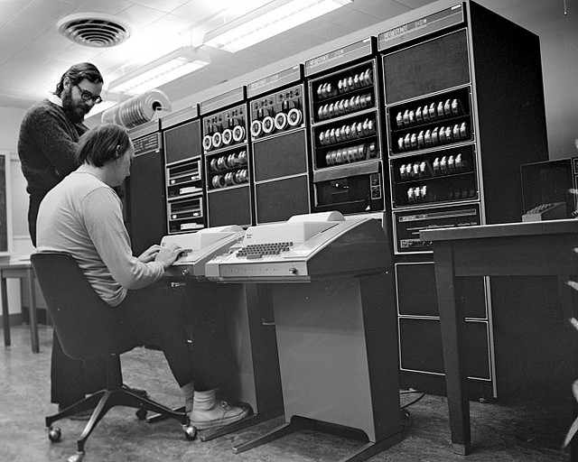

# dotfiles

> **"Unix is simple. It just takes a genius to understand its simplicity."**
> — _Dennis Ritchie_
>
> `[ Edited in ed. Written in C. Shipped on a PDP-11 — the way the world was made. ]`



## Management

Managed entirely with [GNU Stow](https://www.gnu.org/software/stow/).

```bash
git clone [https://github.com/yourusername/dotfiles.git](https://github.com/yourusername/dotfiles.git) ~/dotfiles
cd ~/dotfiles
stow <package_name>
```
